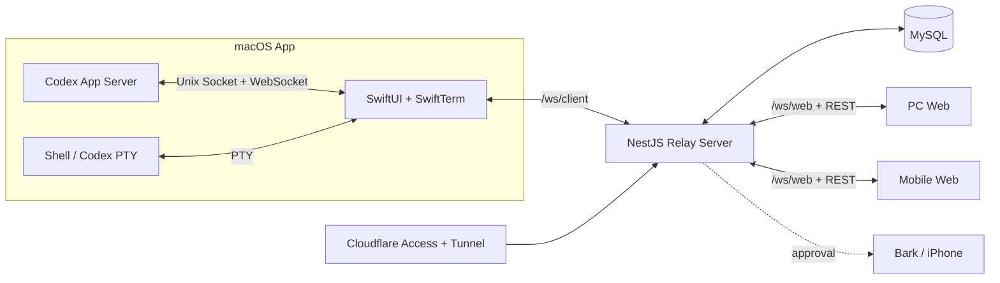

<div align="center">
  

  # TermRelay

  **把 Mac 上的 Shell 与 Codex，带到你手边的每一块屏幕。**

  一套面向个人开发工作流的远程会话中枢：在 macOS 上运行真实 PTY 或 Codex App Server，
  通过 Web 安全查看、交互、审批，并在手机上处理关键任务。

  [快速开始](#快速开始) · [核心能力](#核心能力) · [架构](#架构) · [部署](#生产部署) · [开发文档](#开发文档)
</div>

---

## 为什么是 TermRelay？

AI 编程任务经常运行很久，而审批、补充问题和终端操作并不会等你回到电脑前。TermRelay 把执行环境留在 Mac，把操作界面延伸到桌面浏览器和手机：你可以离开工位，但不必失去对任务的控制。

它不是把终端画面简单录屏到网页。TermRelay 为不同工作方式提供两条明确、互不混用的链路：

| 模式 | 本地运行方式 | Mac 界面 | Web 界面 | 适合场景 |
|---|---|---|---|---|
| **PTY** | 真实伪终端中的 Shell / Codex CLI | SwiftTerm | xterm.js | 完整 TUI、Shell 命令和传统 CLI 工作流 |
| **ACP** | Codex App Server + 独立 Unix Socket | SwiftUI 原生组件 | Vue 原生组件 | 消息流、命令、文件变更、审批和用户问答 |

ACP 会话始终通过 `thread/start` 创建一次性 Thread，不依赖 `resume`，也不会启动 Codex TUI。

## 核心能力

- **真实远程终端**：保留 ANSI、TrueColor、中文、Emoji、终端 resize、输入、Ctrl-C 和停止操作。
- **原生 Codex ACP 体验**：结构化呈现回答、思考、计划、命令输出、文件变更和错误，不把 JSON-RPC 当作终端文本渲染。
- **完整交互闭环**：支持审批的全部可用决策，以及 Codex `requestUserInput` 问答。
- **跨会话审批中心**：PC 与手机 Web 可统一查看多个 ACP 窗口的待审批任务，并直接处理。
- **手机审批通知**：Server 可通过 Bark 将新审批推送到 iPhone；通知开关由 Web 控制并持久化。
- **专用手机页面**：`/mobile` 使用独立的会话、工作区、审批三 Tab 布局，不是桌面页面的压缩版本。
- **实时同步与恢复**：设备注册、心跳、Session 状态、历史事件回放、实时 WebSocket 订阅和命令 ACK。
- **安全部署边界**：推荐使用 Cloudflare Tunnel + Access 发布 Web，Mac Client 继续走可信局域网链路。

## 界面结构

### PC 工作台

PC 页面采用三栏布局，尽量把宽屏空间用于实际工作：

```text
┌──────────────┬────────────────────────────────┬──────────────────┐
│ 会话列表      │ 当前 PTY / ACP 会话             │ 统一审批中心      │
│ 状态与工作区  │ 输出、消息、输入与会话操作       │ 通知开关与决策按钮 │
└──────────────┴────────────────────────────────┴──────────────────┘
```

### 手机工作台

手机页面固定占满动态视口，并适配 iPhone 安全区。顶部展示连接状态，底部 Tab 固定，中间内容独立滚动：

```text
┌─────────────────────────┐
│ TermRelay          在线  │
├─────────────────────────┤
│                         │
│   当前 Tab 的完整内容    │
│                         │
├─────────────────────────┤
│  会话  │  工作区  │ 审批 │
└─────────────────────────┘
```

## 架构



协议由 `packages/contracts` 中的 JSON Schema 定义，并生成 Swift 与 TypeScript 类型。Server 负责校验、持久化、订阅回放和命令路由；Mac 始终是本地进程的所有者。

## 技术栈

| 模块 | 技术 |
|---|---|
| macOS | Swift 6、SwiftUI、AppKit、SwiftTerm |
| Server | Node.js 22、NestJS、Fastify、WebSocket、TypeORM |
| Web | Vue 3、Pinia、Vue Router、xterm.js、Vite |
| 数据与协议 | MySQL 8、JSON Schema、TypeScript / Swift 生成类型 |
| 发布 | Docker、linux/arm64 离线包、Cloudflare Tunnel / Access |

## 快速开始

### 环境要求

- macOS 14 或更高版本
- Swift 6 / Xcode 16+
- Node.js 22+
- pnpm 12+
- Docker Desktop（运行完整 Server + MySQL 环境）
- 已安装并登录的 Codex CLI（使用 Codex PTY/ACP 时）

### 1. 安装依赖并检查工程

```bash
git clone https://github.com/YOUR_NAME/TermRelay.git
cd TermRelay
pnpm install
pnpm check
```

> 发布到 GitHub 后，请把示例仓库地址中的 `YOUR_NAME` 替换为实际组织或用户名。

### 2. 启动开发 Server

开发 Compose 会启动 MySQL、执行迁移，并在本机 `3007` 端口提供 Server 与 Web：

```bash
docker compose -f deploy/server/compose.dev.yaml up --build
```

打开：

- PC：`http://localhost:3007/`
- 手机专用页面：`http://localhost:3007/mobile`
- 健康检查：`http://localhost:3007/health`

### 3. 启动 Mac App

```bash
swift run --package-path apps/mac TermRelay
```

App 默认连接 `ws://localhost:3007/ws/client`。也可以在设置页修改 Server WebSocket 地址、CLI 路径、代理和 ACP 发送快捷键。

新建会话时可以选择：

```text
Shell
└── PTY

Codex
├── PTY
└── ACP（Codex App Server）
```

## 常用开发命令

```bash
# 完整协议校验、类型检查和 Mac 测试
pnpm check

# Server 测试
pnpm --filter @termrelay/server test

# Web 生产构建
pnpm --filter @termrelay/web build

# Mac 测试
pnpm mac:test

# 构建全部 Node/Web 产物
pnpm build
```

真实 Codex App Server 探针需要显式开启，以免普通测试意外启动本地 Agent：

```bash
TERMRELAY_RUN_CODEX_INTEGRATION=1 \
swift test --disable-sandbox --package-path apps/mac \
  --filter CodexAppServerClientTests/testRealFreshACPThroughUnixSocketWhenExplicitlyEnabled
```

## 手机审批通知

TermRelay 使用 Server 端 Bark 地址，设备 Key 不会被打包进 Web 前端。配置环境变量：

```dotenv
BARK_PUSH_URL=https://api.day.app/your-device-key
```

执行数据库迁移并重启 Server 后，在 PC 或手机 Web 的审批中心打开“手机通知”。新审批会包含会话名称和审批内容；开关默认关闭。

不要提交包含真实设备 Key 的 `.env` 文件。仓库只应保留 `.env.*.example`。

## 生产部署

### Server 离线发布

```bash
pnpm release:server --version 0.1.0 --allow-dirty
```

默认生成适用于 `linux/arm64` 的离线 Docker 发布包。部署流程、环境文件和回滚方式见 [Server 发布指南](docs/SERVER_RELEASE.md)。

### Cloudflare

推荐只把 Web 入口发布到 Cloudflare Tunnel，并使用 Access 身份验证保护整个域名及 `/ws/web` WebSocket：

```text
Browser → Cloudflare Access → Tunnel → Server :3006
Mac App → trusted LAN → Server :3006/ws/client
```

不要为 `/ws/web` 添加绕过 Access 的公开策略，也不要把 `/ws/client` 作为公共 Mac 接入入口。配置说明见 [Cloudflare Access 部署](docs/CLOUDFLARE_ACCESS.md)。

## 安全说明

- TermRelay 可以执行终端输入、停止进程并批准 Agent 操作；请把它视为高权限开发工具。
- 公网部署前必须增加可靠的身份边界。当前推荐方案是 Cloudflare Access。
- Bark URL、数据库密码、Access 配置等必须放在未提交的环境文件或 Secret 管理系统中。
- 清理逻辑只处理能够证明由 TermRelay 创建的 Runtime、Socket 和进程，不应扫描或终止无关 Codex 实例。
- ACP 与 PTY 是严格分离的协议路径；ACP 不接受终端输入/resize，PTY 不接受结构化审批命令。

## 仓库布局

```text
apps/
├── mac/                  SwiftUI macOS App、PTY 与 ACP Runtime
├── server/               NestJS API、WebSocket、持久化与通知
└── web/                  Vue PC / Mobile Web
packages/
└── contracts/            JSON Schema 与生成类型
deploy/server/            Docker、Compose 和离线发布配置
docs/                     架构、决策与部署文档
scripts/                  校验和发布脚本
```

## 开发文档

- [整体架构](docs/ARCHITECTURE.md)
- [Codex App Server 架构决策](docs/ADR-001-CODEX-APP-SERVER.md)
- [ACP 原生 UI 重构计划与完成记录](docs/CODEX_APP_SERVER_NATIVE_UI_REFACTOR_PLAN.md)
- [结构化 Agent 适配层](docs/STRUCTURED_AGENT_ADAPTER_DESIGN.md)
- [开发与生产环境](docs/ENVIRONMENTS.md)
- [Cloudflare Access 部署](docs/CLOUDFLARE_ACCESS.md)
- [Server 离线发布](docs/SERVER_RELEASE.md)
- [可行性分析](docs/FEASIBILITY.md)

## 当前阶段

TermRelay 目前是可运行的早期项目，适合个人环境试用和继续开发。协议、数据迁移和核心交互均有自动化检查，但正式对外发布前仍建议补齐：

- 正式签名、公证与自动更新的 macOS 发布流程
- Web 与 API 的应用层身份校验和权限模型
- 更完整的事件级确认、断线补传与长期数据保留策略
- 多用户、多设备隔离与审计策略
- UI 端到端测试和公开演示素材

## 参与贡献

Issue、设计讨论和 Pull Request 都很欢迎。提交前请运行：

```bash
pnpm check
pnpm --filter @termrelay/server test
pnpm --filter @termrelay/web build
```

如果要新增 Agent Provider，请先阅读 [结构化 Agent 适配层设计](docs/STRUCTURED_AGENT_ADAPTER_DESIGN.md)。

## License

仓库目前尚未指定开源许可证。在正式推广或接受外部贡献前，请先选择并添加合适的许可证。
