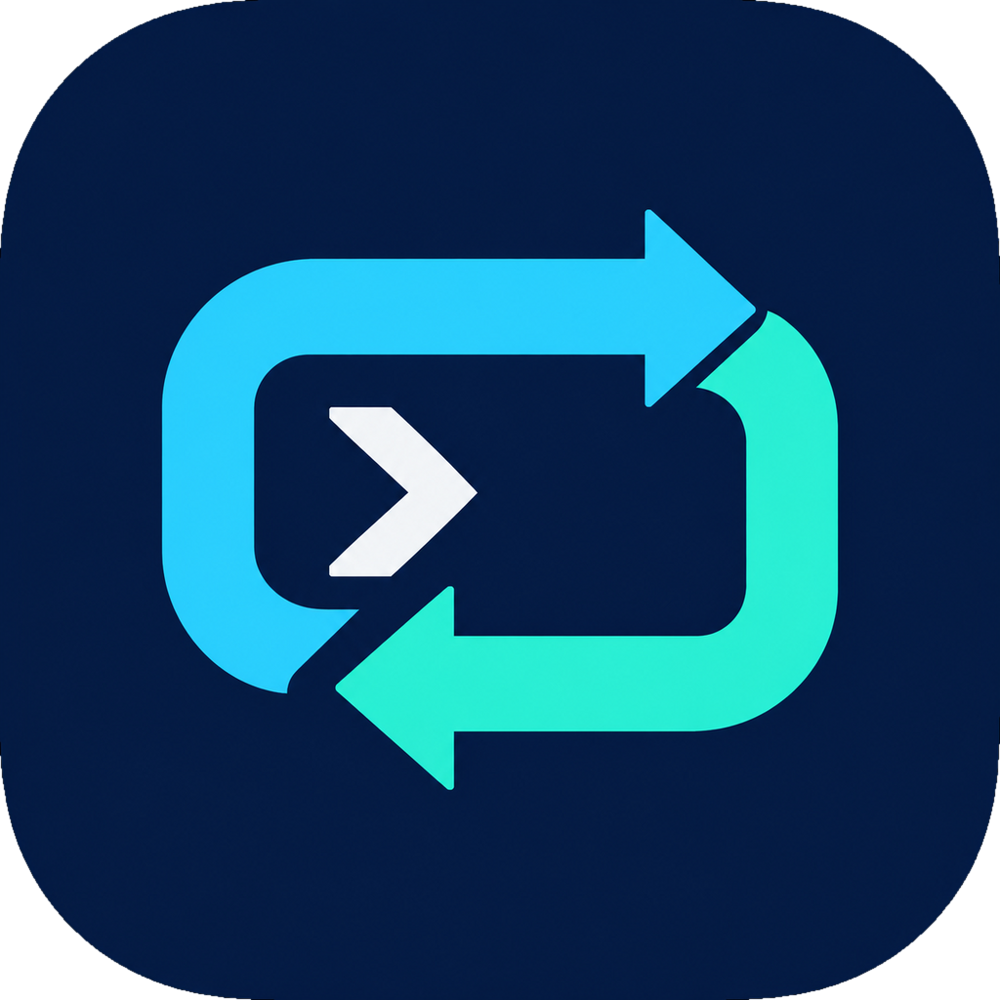
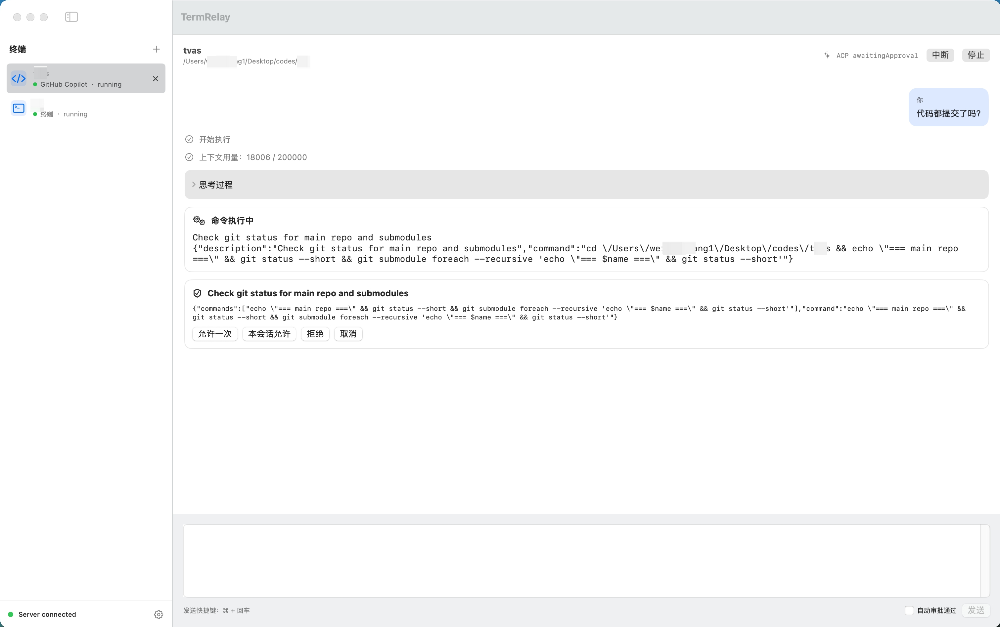
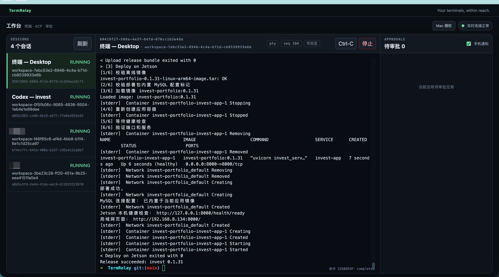
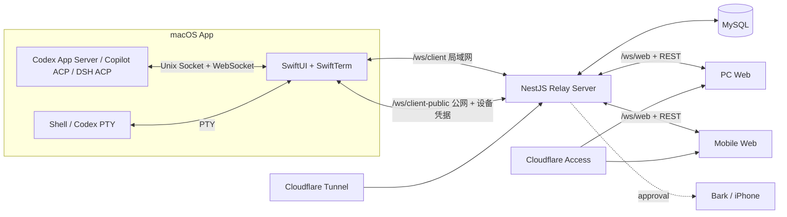

<div align="center">
  

  # TermRelay

  **把 Mac 上的 Shell、Codex、GitHub Copilot 与 DeepSeek DSH，带到你手边的每一块屏幕。**

  一套面向个人开发工作流的远程会话中枢：在 macOS 上运行真实 PTY 或标准 **ACP**（Agent Client Protocol），
  通过 Web 安全查看、交互、审批，并在手机上及时处理需要你决策的任务。

  [快速开始](#快速开始) · [支持的智能体](#支持的智能体) · [架构](#架构) · [手机推送](#手机审批推送) · [部署](#生产部署) · [Cloudflare 配置](#cloudflare-配置) · [环境变量](#环境变量参考)

  <sub>如果这个项目对你有帮助，欢迎点一个 ⭐️ Star。</sub>
</div>

---

## 这是什么

AI 编程任务经常运行很久，而审批、补充问题和终端操作不会等你回到电脑前。TermRelay 把执行环境留在 Mac，
把操作界面延伸到桌面浏览器和手机：你可以离开工位，但不必失去对任务的控制。

它不是把终端画面简单录屏到网页。TermRelay 的核心是 **ACP（Agent Client Protocol）**：对支持 ACP 的智能体，
TermRelay 不再把它们的输出当作终端文本来渲染，而是把消息、思考过程、计划、工具调用、文件变更、审批请求和
用户提问这些结构化事件，通过统一协议转发到 Mac 原生界面和 Web 原生组件，两端呈现完全一致、可交互的界面。
对不需要结构化交互的场景（普通 Shell、传统 CLI TUI），TermRelay 仍然提供一条完整的真实 PTY 链路。

| 模式 | 本地运行方式 | Mac 界面 | Web 界面 | 适合场景 |
|---|---|---|---|---|
| **PTY** | 真实伪终端中的 Shell / Codex CLI | SwiftTerm | xterm.js | 完整 TUI、Shell 命令和传统 CLI 工作流 |
| **ACP** | Codex App Server / Copilot CLI ACP Server / DeepSeek DSH ACP | SwiftUI 原生组件 | Vue 原生组件 | 消息流、思考、工具调用、审批和用户问答 |

PTY 与 ACP 是两条严格分离的链路：ACP 不接受终端输入 / resize，PTY 不接受结构化审批命令，二者不会混用同一份数据。

## 支持的智能体

| 智能体 | 交互模式 | 说明 |
|---|---|---|
| **Shell** | PTY | 你日常使用的登录 Shell（`$SHELL`），完整终端体验 |
| **Codex CLI** | PTY 或 ACP | ACP 模式通过官方 **Codex App Server** 运行，每次以 `thread/start` 创建全新 Thread；App Server 不可用或版本不兼容时自动回退到 PTY |
| **GitHub Copilot CLI** | ACP | 通过 Copilot CLI 官方 **ACP Server** 连接；使用前需在终端执行一次 `copilot login` |
| **DeepSeek DSH** | ACP | 标准 **ACP v1**，每次以 `session/new` 创建隔离会话；API Key 只保存在 macOS 钥匙串，注入本地 DSH 子进程 |

在已启动的结构化会话中，Codex 可从 CLI 提供的模型与推理强度列表选择，变更从下一轮开始生效。Copilot ACP 若公布模型配置选项，可直接切换；若仅公布 `/model` 命令，可在 Mac 或 Web 输入模型 ID 执行会话内模型切换（CLI 的响应会显示在会话中）。Copilot 的推理强度目前只能在启动 ACP Server 时配置，不提供会话内切换。PTY 与 DSH 不显示这些控件。

新增 Agent Provider 时请先阅读 [结构化 Agent 适配层设计](docs/STRUCTURED_AGENT_ADAPTER_DESIGN.md)；其中定义了通用能力模型、事件流和生命周期，接入新智能体不需要改动 Server 或 Web 的核心逻辑。

## 核心能力

- **真实远程终端**：保留 ANSI、TrueColor、中文、Emoji、终端 resize、输入、Ctrl-C 和停止操作。
- **多 Provider 原生 ACP 体验**：结构化呈现回答、思考、计划、命令输出、文件变更和错误，不把 JSON-RPC 当作终端文本渲染。
- **完整交互闭环**：支持审批的全部可用决策，以及 `requestUserInput` 式的用户问答。
- **跨会话审批中心**：PC 与手机 Web 可统一查看多个 ACP 窗口的待审批任务，并直接处理。
- **手机审批推送**：Server 可通过 Bark 将新审批推送到 iPhone；通知开关由 Web 控制并持久化。
- **专用手机页面**：`/mobile` 使用独立的会话、工作区、审批三 Tab 布局，不是桌面页面的压缩版本。
- **实时同步与恢复**：设备注册、心跳、Session 状态、历史事件回放、实时 WebSocket 订阅和命令 ACK。
- **两种安全部署边界**：Web 走 Cloudflare Access；Mac App 可选局域网直连，或通过公网配对 + 设备凭据连接。

## 界面预览

### Mac App：原生 ACP 会话与审批



### Web：远程终端与统一审批中心



## 界面结构

### PC 工作台

PC 页面采用三栏布局，尽量把宽屏空间用于实际工作：

```text
┌──────────────┬────────────────────────────────┬──────────────────┐
│ 会话列表      │ 当前 PTY / ACP 会话             │ 统一审批中心      │
│ 状态与工作区  │ 输出、消息、输入与会话操作       │ 通知开关与决策按钮 │
└──────────────┴────────────────────────────────┴──────────────────┘
```

### 手机工作台

手机页面固定占满动态视口，并适配 iPhone 安全区。顶部展示连接状态，底部 Tab 固定，中间内容独立滚动：

```text
┌─────────────────────────┐
│ TermRelay          在线  │
├─────────────────────────┤
│                         │
│   当前 Tab 的完整内容    │
│                         │
├─────────────────────────┤
│  会话  │  工作区  │ 审批 │
└─────────────────────────┘
```

## 架构



协议由 `packages/contracts` 中的 JSON Schema 定义，并生成 Swift 与 TypeScript 类型。Server 负责校验、持久化、订阅回放和命令路由；Mac 始终是本地进程和本地路径的所有者，Server 只保存不透明的工作区 ID。

## 技术栈

| 模块 | 技术 |
|---|---|
| macOS | Swift 6、SwiftUI、AppKit、SwiftTerm |
| Server | Node.js 22、NestJS、Fastify、WebSocket、TypeORM |
| Web | Vue 3、Pinia、Vue Router、xterm.js、Vite |
| 数据与协议 | MySQL 8、JSON Schema、TypeScript / Swift 生成类型 |
| 发布 | Docker、linux/arm64 离线包、Cloudflare Tunnel / Access |

## 快速开始

### 环境要求

- macOS 14 或更高版本
- Swift 6 / Xcode 16+（Mac 构建需要完整 Xcode 工具链，包含 `metal`；仅安装 Command Line Tools 不够）
- Node.js 22+
- pnpm（版本见根目录 `package.json`）
- Docker Desktop（运行完整 Server + MySQL 环境）
- 已安装并登录的 Codex CLI（使用 Codex PTY/ACP 时）
- 已安装并执行过 `copilot login` 的 GitHub Copilot CLI（使用 Copilot ACP 时）
- 已安装的 DeepSeek `dsh` CLI 与 DeepSeek API Key（使用 DSH ACP 时）

### 1. 安装依赖并检查工程

```bash
git clone https://github.com/wangweijia/TermRelay.git
cd TermRelay
pnpm install
pnpm check
```

### 2. 启动开发 Server

开发 Compose 会启动 MySQL、执行迁移，并在本机 `3007` 端口提供 Server 与 Web：

```bash
docker compose -f deploy/server/compose.dev.yaml up --build
```

打开：

- PC：`http://localhost:3007/`
- 手机专用页面：`http://localhost:3007/mobile`
- 健康检查：`http://localhost:3007/health`

### 3. 启动 Mac App

```bash
swift run --package-path apps/mac TermRelay
```

App 默认连接 `ws://localhost:3007/ws/client`。也可以在设置页修改 Server WebSocket 地址、CLI 路径、代理、ACP 发送快捷键，并把 DSH API Key 安全保存到 macOS 钥匙串。

新建会话时可以选择：

```text
终端（Shell）
└── PTY

Codex
├── PTY
└── ACP（Codex App Server）

GitHub Copilot
└── ACP（Copilot CLI ACP Server）

DeepSeek DSH
└── ACP（标准 ACP v1，无终端模式）
```

## 常用开发命令

```bash
# 完整协议校验、类型检查和 Mac 测试
pnpm check

# Server 测试
pnpm --filter @termrelay/server test

# Web 生产构建
pnpm --filter @termrelay/web build

# Mac 测试（自动携带 SwiftPM 缓存路径和 --disable-sandbox）
pnpm mac:test

# 构建全部 Node/Web 产物
pnpm build
```

真实 Codex App Server 探针需要显式开启，以免普通测试意外启动本地 Agent，也不会发送真实模型请求：

```bash
TERMRELAY_RUN_CODEX_INTEGRATION=1 \
swift test --disable-sandbox --package-path apps/mac \
  --filter CodexAppServerClientTests/testRealFreshACPThroughUnixSocketWhenExplicitlyEnabled
```

真实 DSH ACP 启动探针只验证全新的隔离会话能够进入 ready 并正常关闭：

```bash
TERMRELAY_RUN_DSH_INTEGRATION=1 \
swift test --disable-sandbox --package-path apps/mac \
  --filter DSHACPClientTests/testRealDSHFreshSessionWhenExplicitlyEnabled
```

## 手机审批推送

TermRelay 使用 Server 端 Bark 地址，设备 Key **不会**被打包进 Web 前端，只存在于服务器环境变量中。

1. 在 iPhone 上安装 [Bark](https://apps.apple.com/app/bark-customed-notifications/id1403753865)，复制专属推送地址。
2. 在 Server 环境文件中配置：

   ```dotenv
   BARK_PUSH_URL=https://api.day.app/your-device-key
   ```

3. 执行数据库迁移并重启 Server。
4. 在 PC 或手机 Web 的审批中心打开“手机通知”开关（默认关闭，逐设备持久化）。

新审批推送会包含会话名称和审批内容摘要。**不要**提交包含真实设备 Key 的 `.env` 文件，仓库只应保留 `.env.*.example` 模板。

## 生产部署

### Server 离线发布

```bash
pnpm release:server --version 0.1.0
```

默认生成适用于 `linux/arm64` 的离线 Docker 发布包，不包含生产环境文件或数据库密码。完整的构建、上传、迁移和一键部署流程见 [Server 离线发布指南](docs/SERVER_RELEASE.md)。

### 两种访问路径

TermRelay 的 Web 和 Mac App 走两条独立的信任边界，可以按需只启用其中一种：

```text
浏览器（PC / 手机）→ Cloudflare Access → Tunnel → Server :3006      （必须经过身份验证）
Mac App（局域网）  → 受信 LAN                → Server :3006/ws/client       （无需公网配置）
Mac App（非局域网）→ Cloudflare Tunnel（不经过 Access）→ Server /ws/client-public
                     （凭 TermRelay 自身签发的设备凭据鉴权，见下文）
```

只要你和 Mac 始终在同一局域网，第三条路径可以完全不配置。若需要在外网也能连接 Mac（例如 Mac 放在家里，人在公司或路上），才需要额外的公网配对入口。

## Cloudflare 配置

### 1. Web 入口（浏览器必经，始终需要 Access）

把 Web 发布到 Cloudflare Tunnel，并用 **Cloudflare Access** 保护整个域名（含 `/ws/web` WebSocket 升级）：

1. Zero Trust → Networks → Tunnels，为域名（例如 `termrelay.example.com`）添加 Public Hostname，指向 Server 的 `http://SERVER_LAN_IP:3006`。
2. Zero Trust → Access → Applications，新建 Self-hosted Application 覆盖整个域名，配置身份策略（推荐：邮箱一次性验证码 + 单邮箱白名单）。
3. **不要**为 `/ws/web` 单独添加 Bypass 策略——浏览器登录后靠 Access Cookie 完成鉴权，去掉保护会让终端和审批接口直接暴露在公网。

验证：未登录访问域名应跳转到 Access 登录页；登录后页面能连上 `wss://.../ws/web` 并正常收发数据。详见 [Cloudflare Access 部署](docs/CLOUDFLARE_ACCESS.md)。

### 2. Mac App 公网入口（可选，核心是关闭 Protect with Access）

Mac App 不是浏览器，无法完成 Cloudflare Access 的交互式登录；如果给 `/ws/client-public` 也套上 Access，Mac 永远连不上。**TermRelay 自己实现了一套配对 + 设备凭据机制**来承担这部分鉴权责任，所以这个入口必须绕开 Access，而不是复用 Access 会话：

1. 在同一个 Tunnel 上，为以下路径新增 Public Hostname / 路由（同域名不同 path 即可）：

   ```text
   POST /api/client-pairings          # 创建配对
   POST /api/client-pairings/token    # 轮询兑换设备凭据
   WSS  /ws/client-public              # Mac 公网 WebSocket
   ```

2. 打开这些路由各自的 **Public Hostname 设置**，找到 **“Protect with Access”** 开关，**关闭它**（Toggle Off）。这一步是整个方案能否工作的核心：开着 Access，Mac 的设备凭据请求会先被 Cloudflare 拦成登录页，永远走不到 TermRelay Server。
3. `/client/authorize`（浏览器批准配对的页面）和 `/api/client-approvals`（提交批准）**保持** Access 保护，不要关闭——批准动作必须由已登录用户在浏览器里完成。
4. 建议单独为这两个公开接口配置 Cloudflare Rate Limiting；Server 自身也已内置限流。

配置完成后，在 Mac App 设置页：

1. 点击「使用公网地址」，Server URL 会自动填入 `wss://你的域名/ws/client-public`。
2. 点击「授权此 Mac」，App 会打开系统浏览器跳转到 `/client/authorize?code=...`。
3. 在浏览器完成 Cloudflare Access 登录后，确认页面上显示的设备信息无误并批准。
4. 回到 Mac App，几秒内会显示「已授权」，凭据保存在 macOS 钥匙串，之后重启 App 会自动重连。

设备凭据可以在 Web 设置页随时撤销；撤销后 Mac 上已建立的连接会被主动断开，需要重新走一次授权流程。设计细节、数据模型和失败恢复策略见 [Mac Client 公网配对与认证方案](docs/CLOUDFLARE_MAC_CLIENT_AUTH.md)。

> 不确定是否需要这一步？只要你只在同一个局域网内使用 Mac App，跳过整节内容即可，Web 入口的 Access 配置不受影响。

## 环境变量参考

### Server（`apps/server/.env` 或 `deploy/server/.env.production`）

| 变量 | 默认值 / 示例 | 说明 |
|---|---|---|
| `PORT` / `SERVER_PORT` | `3007`（开发）/ `3006`（生产） | Server 监听端口 |
| `HOST` / `SERVER_BIND_ADDRESS` | `0.0.0.0` | 监听地址 |
| `PUBLIC_ORIGIN` | `https://termrelay.example.com` | 浏览器实际访问的 HTTPS Origin，用于生成配对批准链接；**必填** |
| `CLIENT_CREDENTIAL_LIFETIME_MS` | 留空 | Mac 设备凭据的自动过期时间；留空表示只在被主动撤销时失效 |
| `DB_HOST` / `DB_PORT` / `DB_NAME` / `DB_USER` / `DB_PASSWORD` | 见 `.env.example` | MySQL 连接信息 |
| `DB_MIGRATION_USER` / `DB_MIGRATION_PASSWORD` | 仅生产 | 只用于一次性 migration，不留在长期运行容器中 |
| `BARK_PUSH_URL` | `https://api.day.app/your-device-key` | 手机审批推送地址，留空则不推送 |
| `TERMINAL_EVENT_TTL_HOURS` | `24` | 终端事件回放的保留时长 |
| `WEB_MAX_SESSION_SUBSCRIPTIONS` | `16` | 单个 Web 连接可同时订阅的会话数上限 |
| `WEB_MAX_REPLAY_EVENTS` | `10000` | 单次历史回放的事件数上限 |
| `WEB_SOCKET_PING_INTERVAL_MS` | `25000` | `/ws/web` 心跳间隔；如 Cloudflare 空闲策略变化可调整 |
| `COMMAND_ACK_TIMEOUT_MS` | `15000` | 命令确认超时 |
| `CLIENT_HEARTBEAT_INTERVAL_MS` / `CLIENT_HEARTBEAT_TIMEOUT_MS` | `15000` / `45000` | `/ws/client` 心跳与超时 |

完整模板见 [`apps/server/.env.example`](apps/server/.env.example)、[`deploy/server/.env.production.example`](deploy/server/.env.production.example)。数据库、端口分配和迁移规则见 [开发与生产环境](docs/ENVIRONMENTS.md)。

### 测试专用（不影响正常构建/部署）

| 变量 | 用途 |
|---|---|
| `TERMRELAY_RUN_CODEX_INTEGRATION=1` | 显式开启才会启动真实 Codex App Server 探针 |
| `TERMRELAY_RUN_DSH_INTEGRATION=1` | 显式开启才会启动真实 DSH ACP 探针 |

普通 `pnpm check` / `pnpm mac:test` 不会设置以上变量，不会启动真实 Agent 或发送模型请求。

## 安全说明

- TermRelay 可以执行终端输入、停止进程并批准 Agent 操作；请把它视为高权限开发工具。
- 公网部署前必须为浏览器入口增加可靠的身份边界（Cloudflare Access），为 Mac 公网入口关闭 Access 并依赖 TermRelay 自身的设备配对凭据。
- Bark URL、数据库密码、Cloudflare 相关配置等必须放在未提交的环境文件或 Secret 管理系统中。
- 清理逻辑只处理能够证明由 TermRelay 创建的 Runtime、Socket、进程和 DSH 临时目录，不扫描或终止无关 Agent 实例。
- DSH API Key 只存储在 macOS 钥匙串并注入本地 DSH 子进程，不进入 TermRelay Server、Web、会话事件或日志。
- Mac 设备凭据只授权公网 WebSocket 连接，不赋予浏览器管理接口权限；凭据可随时在 Web 端撤销。
- ACP 与 PTY 是严格分离的协议路径；ACP 不接受终端输入/resize，PTY 不接受结构化审批命令。

## 仓库布局

```text
apps/
├── mac/                  SwiftUI macOS App、PTY 与 ACP Runtime
├── server/               NestJS API、WebSocket、持久化与通知
└── web/                  Vue PC / Mobile Web
packages/
└── contracts/            JSON Schema 与生成类型
deploy/server/            Docker、Compose 和离线发布配置
docs/                     架构、决策与部署文档
scripts/                  校验和发布脚本
```

## 开发文档

- [整体架构](docs/ARCHITECTURE.md)
- [Codex App Server 架构决策](docs/ADR-001-CODEX-APP-SERVER.md)
- [ACP 原生 UI 重构计划与完成记录](docs/CODEX_APP_SERVER_NATIVE_UI_REFACTOR_PLAN.md)
- [结构化 Agent 适配层](docs/STRUCTURED_AGENT_ADAPTER_DESIGN.md)
- [开发与生产环境](docs/ENVIRONMENTS.md)
- [Cloudflare Access 部署（Web 入口）](docs/CLOUDFLARE_ACCESS.md)
- [Mac Client 公网配对与认证方案](docs/CLOUDFLARE_MAC_CLIENT_AUTH.md)
- [Server 离线发布](docs/SERVER_RELEASE.md)
- [可行性分析](docs/FEASIBILITY.md)

## 当前阶段

TermRelay 目前是可运行的早期项目，适合个人环境试用和继续开发。协议、数据迁移和核心交互均有自动化检查，但正式对外发布前仍建议补齐：

- 正式签名、公证与自动更新的 macOS 发布流程
- Web 应用层更完整的多用户权限模型
- 更完整的事件级确认、断线补传与长期数据保留策略
- 多用户、多设备隔离与审计策略
- UI 端到端测试和公开演示素材

## 参与贡献

Issue、设计讨论和 Pull Request 都很欢迎。提交前请运行：

```bash
pnpm check
pnpm --filter @termrelay/server test
pnpm --filter @termrelay/web build
```

如果要新增 Agent Provider，请先阅读 [结构化 Agent 适配层设计](docs/STRUCTURED_AGENT_ADAPTER_DESIGN.md)。

## License

仓库目前尚未指定开源许可证。在正式推广或接受外部贡献前，请先选择并添加合适的许可证。
