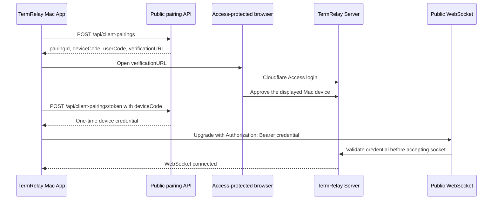

# Mac Client 公网配对与认证方案

## 状态

本文记录 Mac App 通过公网域名连接 TermRelay Server 的待实施设计。当前生产路径仍以
[Cloudflare Access 部署说明](CLOUDFLARE_ACCESS.md)为准：浏览器经过 Cloudflare Access，Mac App
通过受信局域网直连 `/ws/client`。

本方案不依赖 `cloudflared` 客户端，也不尝试从外部浏览器读取 Cloudflare Cookie。Cloudflare 负责
Tunnel、TLS 和边缘防护；TermRelay Server 负责 Mac 设备配对、凭据签发、WebSocket 鉴权和撤销。

## 结论

Cloudflare Access 支持为同一域名的具体路径建立更精确的 Self-hosted Application，并通过
`Bypass` Policy 关闭这些路径的 Access 登录拦截。更具体的路径规则优先于覆盖整个域名的规则。

只对以下专用入口配置 Bypass：

```text
POST /api/client-pairings
POST /api/client-pairings/token
WSS  /ws/client-public
```

浏览器批准页面及其提交接口继续受现有 Cloudflare Access 用户登录保护：

```text
GET  /client/authorize
POST /api/client-approvals
```

现有入口保持不变：

- `/ws/web` 继续要求 Cloudflare Access Cookie。
- `/ws/client` 继续作为受信局域网兼容入口，不通过公网 Bypass 暴露。
- 公网 Mac 使用 `wss://termrelay.wqyhomes.com/ws/client-public`。

Bypass 只关闭 Cloudflare Access 身份校验和 Access 审计，不会关闭 Cloudflare Tunnel、HTTPS 或可单独
配置的 WAF/Rate Limiting。被 Bypass 的路径必须视为公网入口，由 TermRelay 完整承担认证责任。

## 认证流程

采用类似 OAuth Device Authorization Grant 的配对流程，但凭据由 TermRelay Server 签发：



### 1. 创建配对

Mac 调用公开的 `POST /api/client-pairings`，提交设备 ID、显示名称、App 版本以及可选的本机公钥。Server
创建短期配对记录并返回：

```json
{
  "pairingId": "opaque-id",
  "deviceCode": "256-bit-secret",
  "userCode": "ABCD-EFGH",
  "verificationURL": "https://termrelay.wqyhomes.com/client/authorize?code=ABCD-EFGH",
  "expiresIn": 600,
  "pollInterval": 3
}
```

- `deviceCode` 至少包含 256 bit 随机熵，只返回给 Mac，不显示在浏览器 URL 中。
- `userCode` 仅用于用户核对和定位配对，不能单独兑换凭据。
- 配对 5 至 10 分钟过期，只能批准和兑换一次。
- Server 仅保存 `deviceCode` 的摘要，不保存明文。

创建配对不会创建已授权设备，也不会直接签发设备凭据。

### 2. 浏览器批准

App 使用 `NSWorkspace.shared.open` 打开 `verificationURL`。`/client/authorize` 和
`/api/client-approvals` 不在 Bypass 范围内，浏览器必须先完成现有 Cloudflare Access Email OTP 或 IdP
登录。

Server 对 Cloudflare 注入的 `Cf-Access-Jwt-Assertion` 验证签名、`iss`、`aud`、`exp` 和 `nbf`，
显示待配对设备信息，并要求用户明确批准。批准记录保存已验证用户的 `sub` 或 email 用于审计，但不
保存原始 JWT。

### 3. 兑换设备凭据

Mac 按 Server 返回的间隔轮询 `POST /api/client-pairings/token`，提交 `pairingId` 和 `deviceCode`。
批准后，Server 一次性返回设备凭据；未批准时返回标准 pending 状态，被拒绝、过期或已兑换时不再
签发。

第一版使用可撤销的 opaque credential，而不是自包含 JWT：

```text
tr_device_<credential-id>.<32-byte-random-secret>
```

Mac 将完整凭据存入 macOS Keychain。Server 只保存 credential ID、secret 摘要、绑定的 device ID、
创建时间、可空的过期时间、最后使用时间及撤销时间。`expires_at = NULL` 表示凭据不会自动过期，但仍可
由用户或管理员随时撤销。服务端持久状态使单设备撤销和轮换保持简单。

### 4. 建立 WebSocket

公网连接在 HTTP Upgrade 请求中发送凭据：

```http
GET /ws/client-public HTTP/1.1
Upgrade: websocket
Authorization: Bearer tr_device_<credential-id>.<secret>
```

Mac 使用 `URLRequest` 创建 `URLSessionWebSocketTask`：

```swift
var request = URLRequest(url: serverURL)
request.setValue("Bearer \(credential)", forHTTPHeaderField: "Authorization")
let task = urlSession.webSocketTask(with: request)
```

凭据不得放入 URL Query、WebSocket 子协议、日志或 `device.register` 首帧。Server 必须在 Upgrade 阶段
校验凭据，未授权请求不能进入 `DeviceConnectionRegistry`。连接后的 `device.register` 中，
`envelope.deviceId` 必须与凭据绑定的 device ID 一致。

## Cloudflare 配置

保留当前覆盖 `termrelay.wqyhomes.com` 的 Access Application 和用户 Allow Policy。另建一个路径更
具体的 Self-hosted Application，例如 `termrelay-client-public`：

| Path | Policy | 用途 |
| --- | --- | --- |
| `/api/client-pairings` | Bypass / Everyone | 创建配对 |
| `/api/client-pairings/token` | Bypass / Everyone | 轮询并兑换凭据 |
| `/ws/client-public` | Bypass / Everyone | 已认证设备的公网 WebSocket |

注意事项：

- 不要 Bypass `/api/*`、`/ws/*`、`/ws/web` 或 `/ws/client`。
- Cloudflare 的 `path/*` 不匹配父路径 `path`；应逐个配置精确路径，避免依赖宽泛通配符。
- `/client/authorize` 和 `/api/client-approvals` 必须继续命中整站 Access Application。
- 为两个公开配对接口设置 Cloudflare Rate Limiting，并在 Server 再做独立限流。
- Tunnel 继续转发到 Jetson Server；不要直接向公网开放 3006 端口。
- 部署后分别验证未登录浏览器会被保护路径重定向，而公开路径不会跳到 Access 登录页。

Cloudflare 官方明确说明 Bypass 不执行 Access 安全控制，且请求不进入 Access 审计。因此，生产日志和
安全审计必须由 Server 补齐。

## Server 设计

### 数据模型

所有数据库变化使用显式 TypeORM Migration，并保持 `synchronize: false`。建议增加：

`client_pairings`：

- `id`
- `device_id`
- `device_name`
- `app_version`
- `device_code_hash`
- `user_code_hash`
- `status`: `pending | approved | denied | consumed | expired`
- `approved_by`
- `expires_at`
- `approved_at`
- `consumed_at`
- `created_at`

`device_credentials`：

- `id`
- `device_id`
- `secret_hash`
- `created_at`
- `expires_at`，可空；`NULL` 表示不自动过期
- `last_used_at`
- `revoked_at`
- `approved_by`

索引需覆盖 user code 查询、待配对过期清理、device ID 和 credential ID 查询。过期配对和撤销后的凭据
应定期物理清理。

### 服务边界

- `ClientPairingService`：创建、批准、拒绝、轮询和一次性兑换配对。
- `DeviceCredentialService`：生成、哈希、验证、轮换和撤销凭据，并维护凭据与活跃连接的关联。
- `CloudflareAccessVerifier`：只用于受保护的浏览器批准接口，动态获取并缓存团队 JWKS。
- 公网 WebSocket Gateway：只服务 `/ws/client-public`，在 Upgrade 阶段验证 Bearer 凭据。
- 当前 `ClientGateway` 和 `/ws/client` 保持局域网行为，避免一次改动同时改变现有可用路径。

`Cf-Access-Jwt-Assertion` 只能证明浏览器批准者身份，不能作为 Mac 的长期凭据。Mac 设备只能使用
TermRelay 签发的 device credential。

### WebSocket Upgrade 鉴权

当前 NestJS `WsAdapter` 在 Gateway 建立后才调用 `handleConnection`。实现时应确认 Adapter 是否将
Upgrade Request 作为连接回调参数传递；如果无法在 Gateway 中可靠访问并异步验证 Header，则新增
自定义 `WsAdapter` 或独立 `WebSocketServer({ noServer: true })` Upgrade 处理器。

必须满足：

1. 解析并限制 `Authorization` Header 长度。
2. 使用 credential ID 定位记录，再以常量时间比较 secret 摘要。
3. 校验未撤销、绑定设备可用，并且 `expires_at` 为空或晚于当前时间。
4. 鉴权成功后才把 socket 放入连接注册表。
5. 将已认证 device ID 附加到连接上下文。
6. `device.register` 再次校验相同 device ID，防止身份替换。
7. 失败时返回 HTTP `401`，不要升级后再用业务消息拒绝。

### 凭据校验生命周期

不对已建立的连接进行每 30 至 60 秒的数据库轮询，也不在每次心跳或业务消息中重复校验凭据。完整
闭环由“连接时校验”和“撤销时主动通知”组成：

1. App 每次启动时从 Keychain 读取凭据，并使用该凭据建立 `/ws/client-public` 连接。
2. Server 在 WebSocket Upgrade 阶段执行权威校验。Keychain 中存在凭据不代表凭据仍然有效。
3. 任何断线重连都重新经过相同的 Upgrade 校验，因此 Server 重启、网络切换和 App 恢复连接都会重新
  确认凭据状态。
4. 连接成功后，Server 将 credential ID 和已认证 device ID 绑定到连接上下文，并维护从 credential ID
  到活跃 socket 的索引。
5. Web 管理页撤销凭据时，必须通过 `DeviceCredentialService` 原子写入 `revoked_at`，再通知该凭据的
  所有活跃连接；不能只直接修改数据库。
6. 如果凭据没有活跃连接，撤销仍然生效，下一次 Upgrade 会返回 `401`。

正常运行期间，已认证连接沿用连接建立时的授权上下文。心跳只维护在线状态和连接存活，不承担凭据
数据库校验。

### 主动撤销通知

新增 Server → Mac 控制消息 `client.authorization-revoked`。该消息进入协议 Contract，建议 payload
只包含非敏感状态：

```json
{
  "reason": "revoked",
  "revokedAt": "2026-09-21T12:00:00.000Z"
}
```

`reason` 至少支持 `revoked`、`expired` 和 `device_disabled`。撤销流程为：

1. Server 提交数据库撤销事务。
2. Server 向与该 credential ID 关联的活跃 socket 发送 `client.authorization-revoked`。
3. Server 随后以应用关闭码 `4003` 和不含敏感信息的原因关闭 WebSocket。
4. Mac 收到消息或 `4003` 后，删除 Keychain 中的凭据、停止自动重连并显示“需要重新授权”。

通知用于及时更新 App 状态，真正的安全边界仍是 Server 已经写入的 `revoked_at`。即使通知发送失败或
App 在撤销时离线，凭据也无法通过下一次 Upgrade。若 `expires_at` 非空并在连接期间到期，Server 可在
每次连接鉴权成功时为该 socket 安排一次到期任务，按同一消息和关闭流程处理，无需周期扫描所有连接。

## Mac App 改动

- 在设置页提供“授权此 Mac”“取消配对”“撤销本机凭据”和公网地址快捷配置。
- 使用系统浏览器打开批准页面，不嵌入 WebView，不读取 Cloudflare Cookie。
- 将 `deviceCode` 仅保存在配对过程内存中；取消、失败或超时后立即清除。
- 将正式 device credential 保存到现有 macOS Keychain，不进入 `UserDefaults`。
- `RemoteClient` 接受按目标生成的认证 Header；只向明确配置的公网入口发送凭据。
- 公网连接默认使用 `wss://termrelay.wqyhomes.com/ws/client-public`。
- 局域网 `ws://.../ws/client` 保留无凭据连接能力。
- App 每次启动及每次断线重连都由 Server 在 Upgrade 阶段重新校验 Keychain 中的凭据。
- 收到 `client.authorization-revoked`、关闭码 `4003` 或 Upgrade `401` 后删除凭据、停止指数重连并
  提示重新授权；普通网络错误继续退避重连。
- App 启动和后台重连不能自动打开浏览器，授权必须由用户主动触发。

## 安全要求

- 所有 secret 使用系统 CSPRNG；设备凭据至少 256 bit 随机熵。
- 数据库只保存 secret 摘要。若使用 SHA-256，原始 secret 必须足够随机；也可使用带服务端 pepper 的
  HMAC-SHA-256。
- 对配对创建、轮询、批准和失败鉴权分别限流；轮询遵守 Server 返回的间隔。
- 不信任客户端提交的 device ID、设备名、App 版本、IP 或 User-Agent 作为授权证明。
- 不在日志、异常、指标、URL、数据库明文字段或会话事件中记录凭据和 device code。
- 批准页显示设备名、设备 ID 缩写、请求时间和来源 IP，防止用户误批。
- 支持从受 Access 保护的 Web 管理页查看和撤销单台设备。
- 所有撤销操作必须经过 `DeviceCredentialService`，确保数据库状态和活跃连接通知同步执行。
- 源站只应通过 Cloudflare Tunnel 对公网可达；局域网入口也不能被路由器端口转发到公网。
- 设备凭据只授权 Mac Client 连接，不赋予浏览器管理 API 权限。

## 失败与恢复

- `authorization_pending`：继续按建议间隔轮询。
- `slow_down`：增加轮询间隔。
- `access_denied`：停止轮询并提示用户。
- `expired_token`：清除临时配对状态，允许重新发起。
- `client.authorization-revoked` 或关闭码 `4003`：删除正式凭据，停止重连并要求重新授权。
- WebSocket Upgrade `401`：删除或标记正式凭据失效，要求重新授权。
- Server 暂时不可达：保留正式凭据；只有明确撤销、明确 `401` 或已知非空 `expires_at` 到期时才删除。

配对兑换响应应设置 `Cache-Control: no-store`。同一 `deviceCode` 的并发兑换必须通过事务或唯一状态更新
保证只有一个请求获得凭据。

## 测试与验收

### 自动化测试

- 配对随机值、过期、拒绝、单次批准和单次兑换。
- 缺少或伪造 Cloudflare Assertion 时不能批准配对。
- Cloudflare JWT 的签名、`iss`、`aud`、`exp`、`nbf` 和密钥轮换。
- 设备凭据的哈希存储、绑定、可空过期时间、撤销、轮换和常量时间比较。
- 缺失、错误、过期或撤销的 Bearer Credential 无法完成 WebSocket Upgrade。
- 已认证 device ID 与 `device.register` 不一致时拒绝连接。
- 未认证 socket 不进入 `DeviceConnectionRegistry`。
- 每次 App 启动和断线重连都会重新执行 Upgrade 鉴权。
- 撤销操作提交数据库后向活跃连接发送 `client.authorization-revoked` 并以 `4003` 断开。
- 撤销通知发送失败或 App 离线时，下一次 Upgrade 仍拒绝已撤销凭据。
- 心跳和普通业务消息不会触发凭据数据库查询。
- 公网与局域网 Gateway 相互隔离，现有局域网测试保持通过。
- Mac 配对取消、超时、Keychain 保存和认证失败停止重连。

普通测试使用假的 Cloudflare Assertion/JWKS 和固定随机源，不访问真实 Cloudflare，也不打开浏览器。

### 手工验收

1. 未登录浏览器访问 `/client/authorize` 时进入 Cloudflare Access 登录。
2. 未授权客户端不能连接 `/ws/client-public`。
3. Mac 创建配对后，用户可在浏览器核对并批准指定设备。
4. 配对凭据只能兑换一次，过期或拒绝后不能兑换。
5. 批准后 Mac 自动连接 `wss://termrelay.wqyhomes.com/ws/client-public`。
6. 公网下注册、心跳、Session 同步、输入、resize、interrupt 和审批正常。
7. Web 管理页撤销设备后，现有连接收到 `client.authorization-revoked`、清除凭据并断开，新连接立即
  失败。
8. 局域网 `/ws/client` 行为无回归。
9. App、Server 和 Cloudflare 可见日志中均没有 secret。

## 分阶段实施

1. **Cloudflare 路径探针**：创建精确 Bypass 规则，验证公开路径与受保护路径不会互相覆盖。
2. **Server 凭据基础**：Migration、配对服务、批准接口、设备凭据及撤销。
3. **公网 Gateway**：新增 `/ws/client-public` 并在 Upgrade 前完成鉴权。
4. **Mac 配对 UI**：系统浏览器批准、轮询、Keychain 和带 Bearer Header 的连接。
5. **管理与加固**：设备列表、撤销、限流、清理任务和安全审计。

## 不采用的方案

- **`cloudflared access login`**：需要额外 Helper，用户 Access JWT 到期后需重复登录，不作为当前实施方案。
- **外部浏览器 Cookie 回传**：`CF_Authorization` 通常为 HttpOnly，不应尝试提取或转发。
- **Service Token**：是长期机器 Secret，不表达交互式用户批准，不应嵌入桌面 App。
- **公开 Token 签发接口**：如果未经过配对批准即可领取凭据，任何公网客户端都能冒充设备。
- **WebSocket 首帧认证**：未认证连接已占用资源；认证应在 HTTP Upgrade 前完成。

## 官方参考

- [Cloudflare Access application paths](https://developers.cloudflare.com/cloudflare-one/access-controls/policies/app-paths/)
- [Cloudflare Access policies and Bypass](https://developers.cloudflare.com/cloudflare-one/access-controls/policies/)
- [Validate Cloudflare Access JWTs](https://developers.cloudflare.com/cloudflare-one/access-controls/applications/http-apps/authorization-cookie/validating-json/)
